# Azure AppGateway & VMSS - Terraform Lab

<!-- prettier-ignore-start -->
[](https://dev.azure.com/aintnier/azure-appgateway-vmss-terraform-ansible/_build/latest?definitionId=1&branchName=main)
[?branchName=main&label=Deploy)](https://dev.azure.com/aintnier/azure-appgateway-vmss-terraform-ansible/_build/latest?definitionId=2&branchName=main)
[?branchName=main&label=Destroy)](https://dev.azure.com/aintnier/azure-appgateway-vmss-terraform-ansible/_build/latest?definitionId=3&branchName=main)
<!-- prettier-ignore-end -->

[](https://azure.microsoft.com/)
[](https://www.terraform.io/)
[](https://docs.microsoft.com/en-us/azure/active-directory/develop/workload-identity-federation)

N-tier IaaS architecture on Azure featuring Application Gateway (L7), Standard Load Balancer (L4), dual Virtual Machine Scale Sets (Frontend + Backend), Ansible configuration management via cloud-init, and full governance guardrails - all managed via **Terraform** and orchestrated through **Azure DevOps CI/CD** pipelines with **OIDC authentication**.

---

## Table of Contents

- [Azure AppGateway \& VMSS - Terraform Lab](#azure-appgateway--vmss---terraform-lab)
  - [Table of Contents](#table-of-contents)
    - [Traffic Flow (N-Tier Serial Traversal)](#traffic-flow-n-tier-serial-traversal)
  - [Skills Demonstrated](#skills-demonstrated)
  - [Prerequisites](#prerequisites)
  - [Phase 0: Project Foundation](#phase-0-project-foundation)
    - [Zero-Trust Authentication (OIDC)](#zero-trust-authentication-oidc)
    - [Remote Terraform State](#remote-terraform-state)
    - [Azure DevOps Setup](#azure-devops-setup)
    - [Continuous Integration (CI) \& Self-Hosted Linux Agent](#continuous-integration-ci--self-hosted-linux-agent)
  - [CI/CD Workflows](#cicd-workflows)
  - [Phase 1: Infrastructure Deployment \& Governance](#phase-1-infrastructure-deployment--governance)
    - [Azure Policy \& Resource Tagging](#azure-policy--resource-tagging)
    - [Cost Governance \& Alerting](#cost-governance--alerting)
    - [Secrets Management](#secrets-management)
  - [Phase 2: Networking \& Application Delivery](#phase-2-networking--application-delivery)
    - [Network Topology](#network-topology)
    - [Load Balancer \& Health Probes](#load-balancer--health-probes)
    - [Path-Based Routing \& WAF Inspection (L7)](#path-based-routing--waf-inspection-l7)
  - [Phase 3: Zero-Trust Secure Access](#phase-3-zero-trust-secure-access)
    - [Bastion Debugging \& The Missing Egress](#bastion-debugging--the-missing-egress)
  - [Phase 4: Load Testing \& VMSS Autoscaling](#phase-4-load-testing--vmss-autoscaling)
    - [SKU Upgrade \& Load-Testing Troubleshooting](#sku-upgrade--load-testing-troubleshooting)
    - [Autoscaling Events \& Notifications](#autoscaling-events--notifications)
  - [Phase 5: Infrastructure Teardown](#phase-5-infrastructure-teardown)
  - [Key Technical Decisions](#key-technical-decisions)
  - [Known Limitations](#known-limitations)
  - [Repository Structure](#repository-structure)
  - [Tech Stack](#tech-stack)
  - [License](#license)

### Traffic Flow (N-Tier Serial Traversal)

1. **Internet -> AppGW** - HTTPS 443, TLS termination via self-signed cert from Key Vault
2. **AppGW -> Frontend VMSS** - Basic routing rule, all traffic forwarded to `frontend-pool` (HTTP 80)
3. **Frontend Nginx** - Serves `/` locally (hostname page), reverse-proxies `/api` to Internal LB
4. **Internal LB -> Backend VMSS** - TCP port 80 load balancing across backend instances
5. **Backend Nginx** - Serves `/api` with API response page

---

## Skills Demonstrated

| Area                         | Detail                                                                                                                                                                         |
| ---------------------------- | ------------------------------------------------------------------------------------------------------------------------------------------------------------------------------ |
| **Azure Networking**         | Application Gateway WAF v2 (L7), Standard Internal Load Balancer (L4), NSG subnet isolation, path-based routing via Nginx reverse proxy                                        |
| **Compute & Scaling**        | VMSS with CPU-based autoscale rules, cloud-init OS bootstrap, dual-tier instance pools (Frontend + Backend)                                                                    |
| **Configuration Management** | Ansible Local-Pull via cloud-init `custom_data`, idempotent playbook with role-based templates (frontend/backend)                                                              |
| **Infrastructure as Code**   | Terraform flat-file layout (domain-split, no `main.tf`), remote state with locking, `locals {}` + `try()` dependency chains                                                    |
| **CI/CD & Automation**       | Azure DevOps multi-stage pipelines (CI, Deploy, Destroy), OIDC federated auth (zero static secrets), manual approval gates, Self-Hosted Linux Agent execution                  |
| **Security & Zero-Trust**    | Key Vault RBAC (managed identity for AppGW), WAF Detection mode (OWASP 3.2), Azure Bastion (no public IPs on VMs), NSG deny-all Internet                                       |
| **FinOps & Governance**      | Azure Policy (SKU + region restriction), Consumption Budget with Action Group alerts, standard tagging (`project`, `managed_by`, `environment`, `owner`, `ttl`, `cost-center`) |
| **Observability**            | Log Analytics Workspace, AppGW diagnostic settings (access/WAF/performance logs), Azure Monitor autoscale alerts, Network Watcher (IP Flow Verify, Topology)                   |
| **Load Testing**             | Azure Load Testing (IaC-provisioned), JMeter test plan (~1000 req/s), P95 latency & autoscaling trigger validation (5% CPU tuning)                                             |

## Prerequisites

- **Azure CLI** (`v2.50+`) authenticated with an active subscription
- **Terraform** (`v1.14.8`) installed locally (for formatting/validation)
- **Azure DevOps** account with organization-admin rights (to configure Service Connections)

---

## Phase 0: Project Foundation

Before deploying the infrastructure, two foundation pieces must be established once via the Azure CLI and portal.

### Zero-Trust Authentication (OIDC)

This project does **not** use long-lived client secrets. Azure DevOps pipelines authenticate to Azure exclusively through **OpenID Connect (OIDC) Federated Identity**.

| Azure DevOps Object     | Type               | Description                                                                               |
| ----------------------- | ------------------ | ----------------------------------------------------------------------------------------- |
| `azure-oidc-connection` | Service Connection | ARM service connection using **Workload Identity Federation (OIDC)**. No client secret.   |
| `terraform-vars`        | Variable Group     | Variable group linked to the pipelines. Can hold overrides for Terraform variables.       |
| `dev`                   | Environment        | Deployment environment with **manual approval gate** configured for Apply/Destroy stages. |

<details>
<summary>Azure CLI App Registration commands</summary>

```bash
# Create App Registration
az ad app create --display-name "azdevops-appgw-vmss-lab"
az ad sp create --id <APP_ID>

# Assign Infrastructure Roles
az role assignment create --assignee <SP_ID> --role Contributor --scope /subscriptions/<SUB_ID>
az role assignment create --assignee <SP_ID> --role "Resource Policy Contributor" --scope /subscriptions/<SUB_ID>
az role assignment create --assignee <SP_ID> --role "Role Based Access Control Administrator" --scope /subscriptions/<SUB_ID>

# Create Federated Credential (OIDC)
az ad app federated-credential create --id <APP_OBJECT_ID> --parameters '{
  "name": "azure-devops-federated-credential",
  "issuer": "<ISSUER_URL_FROM_ADO>",
  "subject": "<SUBJECT_IDENTIFIER_FROM_ADO>",
  "description": "Azure DevOps OIDC Connection",
  "audiences": ["api://AzureADTokenExchange"]
}'
```

</details>

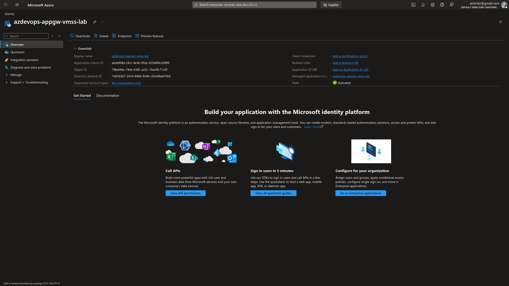
_Fig. 1: App Registration `azdevops-appgw-vmss-lab` overview._
<br>
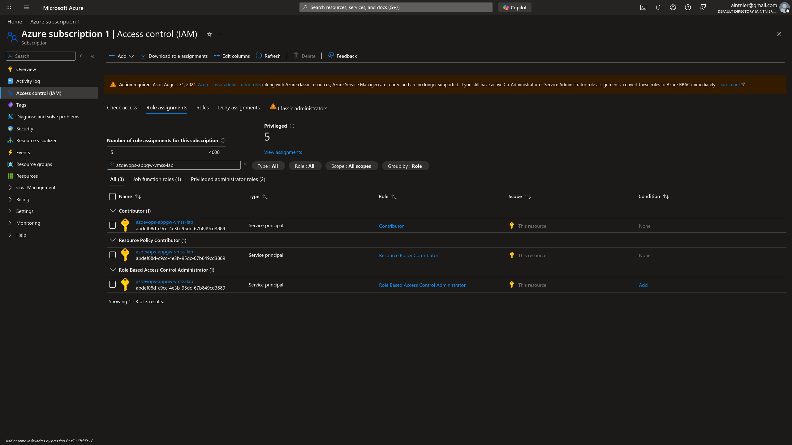
_Fig. 2: Infrastructure IAM role assignments granted to the Service Principal at the Subscription scope._
<br>
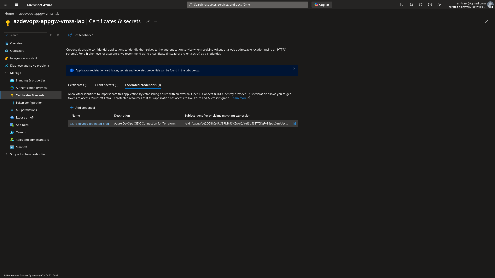
_Fig. 3: OIDC Federated Credential established to authorize Azure DevOps without long-lived secrets._

### Remote Terraform State

Terraform state is stored in a dedicated Azure Storage Account with state locking enabled:

| Storage Account          | Container | State Key                 |
| ------------------------ | --------- | ------------------------- |
| `stterraformstate080426` | `tfstate` | `appgateway-vmss.tfstate` |

<details>
<summary>Azure CLI setup commands</summary>

```bash
RESOURCE_GROUP="rg-terraform-state"
STORAGE_ACCOUNT="stterraformstate080426"
CONTAINER="tfstate"
LOCATION="westeurope"

az group create \
  --name "$RESOURCE_GROUP" \
  --location "$LOCATION"

az storage account create \
  --name "$STORAGE_ACCOUNT" \
  --resource-group "$RESOURCE_GROUP" \
  --location "$LOCATION" \
  --sku Standard_LRS \
  --kind StorageV2 \
  --min-tls-version TLS1_2

az storage container create \
  --name "$CONTAINER" \
  --account-name "$STORAGE_ACCOUNT" \
  --auth-mode login
```

</details>

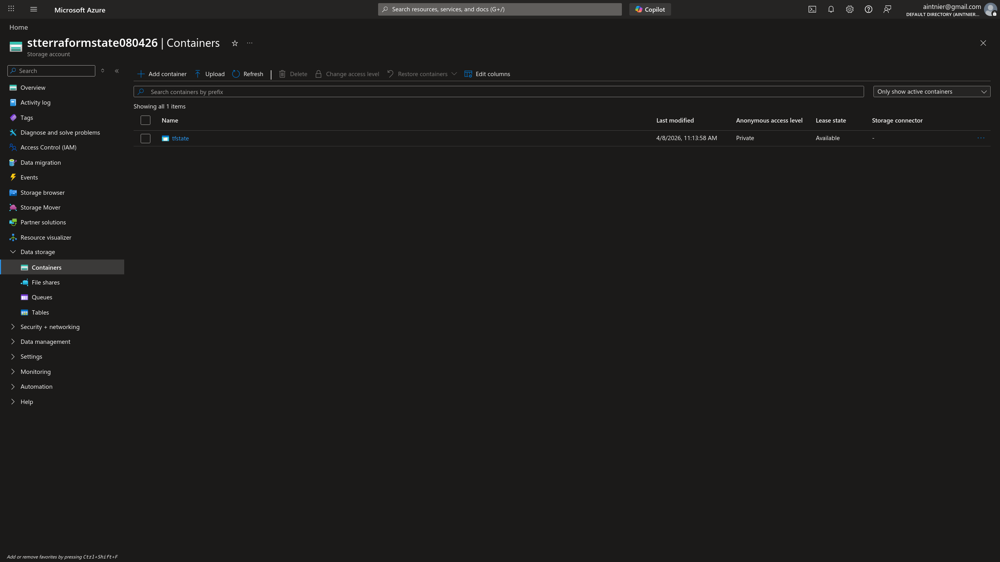
_Fig. 4: The `tfstate` Blob container ready to host the Terraform remote state._

> Update `infra/backend.tf` if you change the Storage Account name or Resource Group.

### Azure DevOps Setup

Once the App Registration is in place, the Azure DevOps project was configured to enable the pipeline execution.

1. **Environment (Approval Gates)**
   Created a `dev` environment with explicit "Approvals and checks" to prevent accidental `terraform apply` or `destroy` runs.
   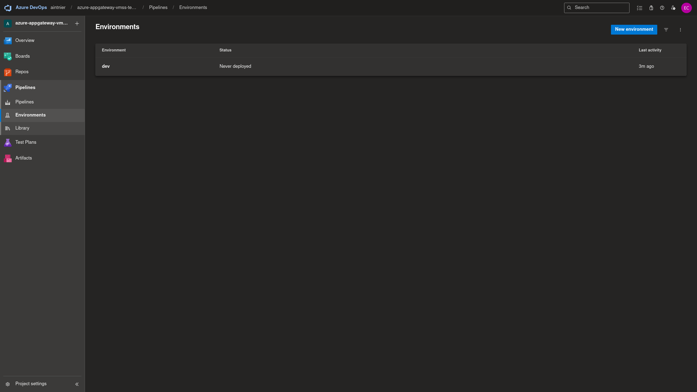
   _Fig. 5: The `dev` Environment enforcing a manual approval gate._

2. **Variable Group**
   Created an empty `terraform-vars` variable group (with a placeholder variable) to safely inject parameters into the IaC workflow.
   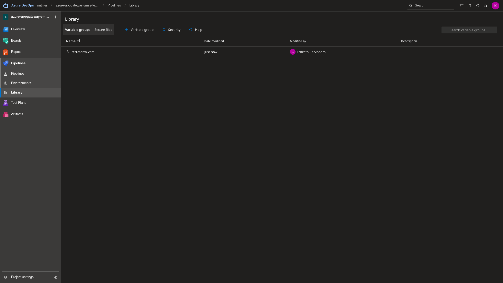
   _Fig. 6: The `terraform-vars` Variable Group linked to the pipelines._

3. **Service Connection (OIDC)**
   Configured `azure-oidc-connection` using "Workload Identity federation (manual)". The `Issuer` and `Subject identifier` generated by Azure DevOps were then provisioned as a Federated Credential in the Entra ID App Registration to establish trust.
   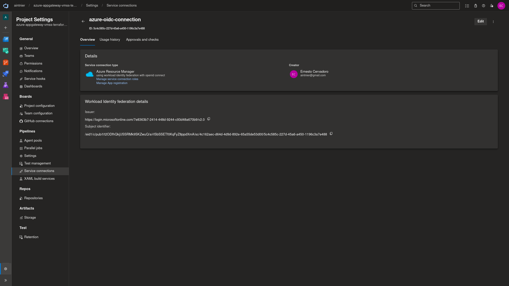
   _Fig. 7: The OIDC Service Connection fully established and validated._

### Continuous Integration (CI) & Self-Hosted Linux Agent

The Azure DevOps CI pipeline ([`ci-pipeline.yml`](pipelines/ci-pipeline.yml)) runs `terraform fmt -check` and `terraform validate` on every push and pull request to `main` - without contacting Azure state.

To bypass the requirement for a Microsoft-hosted parallelism grant (often restricted for new organizations), this project utilizes a **Self-Hosted Linux Agent**. The agent runs persistently on the local machine, and all YAML pipelines are explicitly configured to execute jobs via this pool (`pool: name: "Default"`). This ensures immediate CI/CD execution using local compute resources.

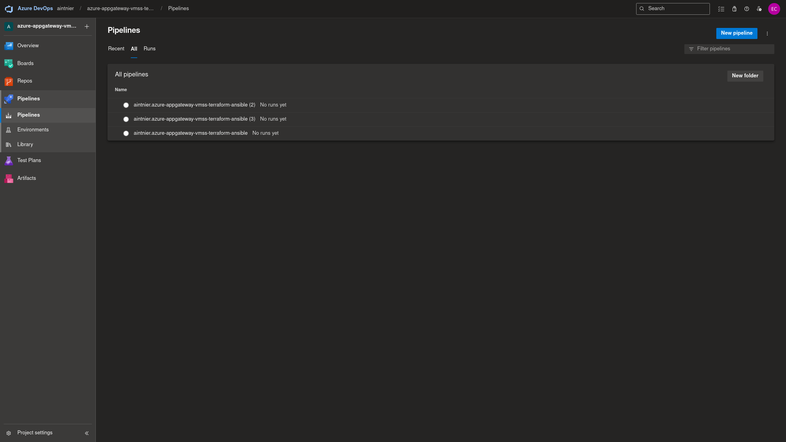
_Fig. 8: The pipeline registration process connecting the GitHub YAML definition to Azure DevOps._
<br>
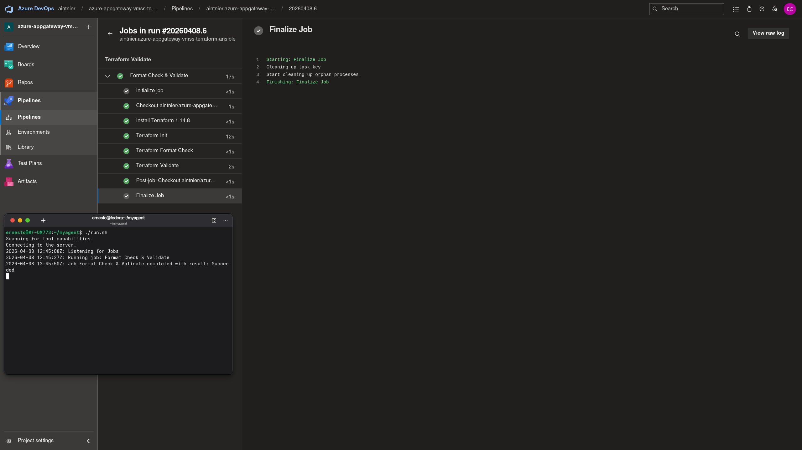
_Fig. 9: Successful execution of the CI pipeline passing validation. As seen in the split-screen view, the local Linux terminal (acting as the Self-Hosted agent) intercepts and processes the pending ADO job in real-time._

---

## CI/CD Workflows

Apply and destroy workflows are **manual by design** to prevent accidental infrastructure changes.

| Pipeline               | Trigger             | Stages                                                              |
| ---------------------- | ------------------- | ------------------------------------------------------------------- |
| `ci-pipeline.yml`      | Push / PR to `main` | `fmt -check` -> `validate`                                          |
| `deploy-pipeline.yml`  | Manual              | `plan` -> publish artifact -> manual approval -> `apply`            |
| `destroy-pipeline.yml` | Manual              | `plan -destroy` -> publish artifact -> manual approval -> `destroy` |

> You can find the pipeline definitions in the [`pipelines/`](pipelines/) directory.

Authentication uses **OIDC Federated Identity** on all pipelines. No static client secret is stored anywhere in the repository.

> ⚠️ **Never run `terraform plan`, `apply`, or `destroy` from the local terminal.** All operations are executed exclusively through CI/CD pipelines.

---

## Phase 1: Infrastructure Deployment & Governance

The automated pipeline (`deploy-pipeline.yml`) provisions the entire Azure environment. By managing governance rules directly via Terraform, the infrastructure is compliant by design.

### Azure Policy & Resource Tagging

Azure Policies limit deployments to the `westeurope` region and restrict the allowed VM SKUs. The root [`infra/variables.tf`](infra/variables.tf) file ensures all resources automatically inherit the necessary tags.

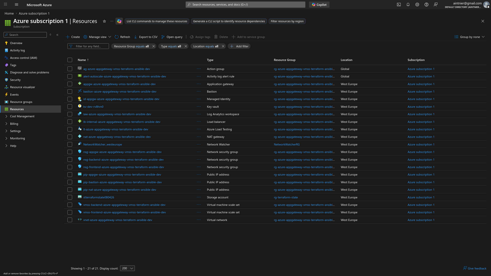
_Fig. 10: Resource Group showing the deployed resources cleanly tagged._
<br>
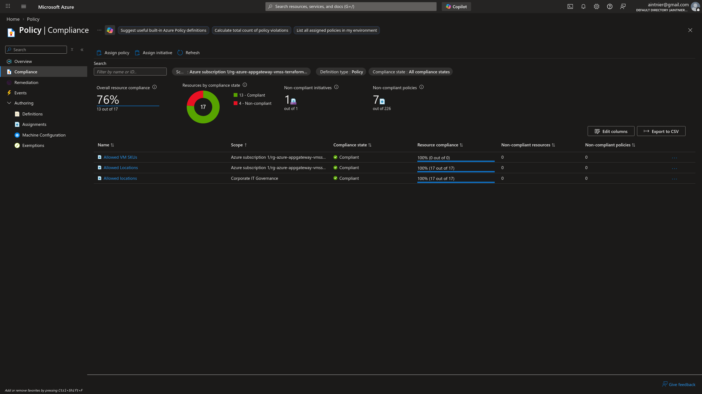
_Fig. 11: Policy compliance panel confirming the VM SKU restrictions & West Europe location policy._

### Cost Governance & Alerting

To prevent unexpected charges, a consumption budget caps the lab costs at €6. Azure Monitor Action Groups are configured to send email alerts when usage hits 50% and 80% of the threshold.

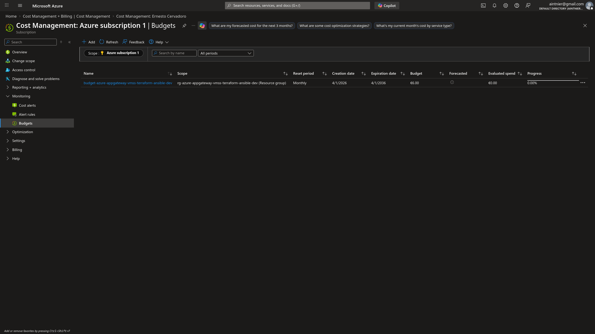
_Fig. 12: Consumption Budget tracking the session._
<br>
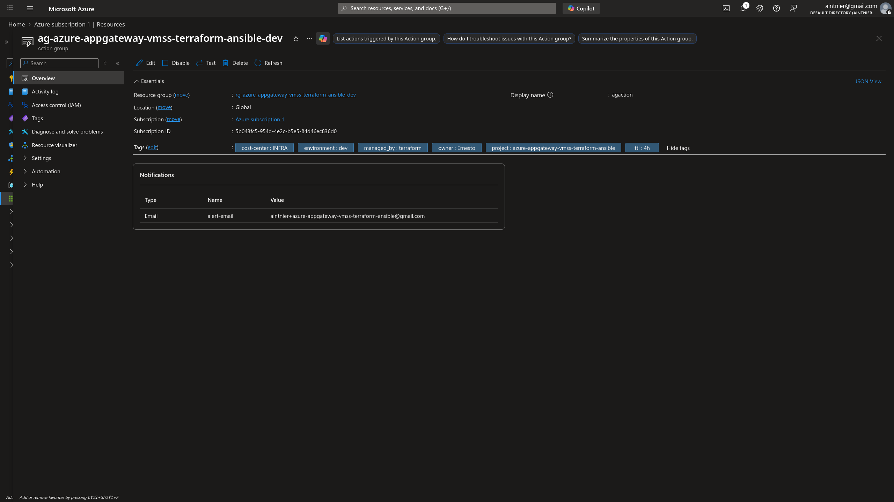
_Fig. 13: Action Group email alerting configuration._

### Secrets Management

No secrets are exposed in plain text. Terraform dynamically generates the SSH keys and the self-signed TLS certificate for the Application Gateway, storing them securely in Azure Key Vault.

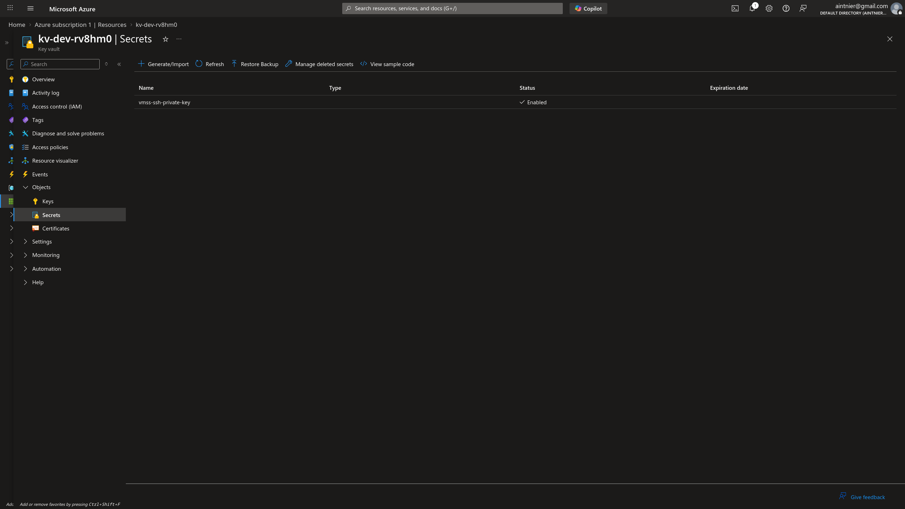
_Fig. 14: SSH Key stored securely in Key Vault._

---

## Phase 2: Networking & Application Delivery

The network flow enforces strict routing: `Internet -> AppGW -> VMSS Frontend -> Standard LB -> VMSS Backend`.

### Network Topology

Azure Network Watcher provides a clear map of the topology, confirming subnet isolation and load balancer placement.


_Fig. 15: Infrastructure topology diagram._

### Load Balancer & Health Probes

The health probes for both Layer 7 (App Gateway) and Layer 4 (Internal LB) are healthy. This confirms that the Nginx instances were successfully configured by Ansible via `cloud-init` during boot.

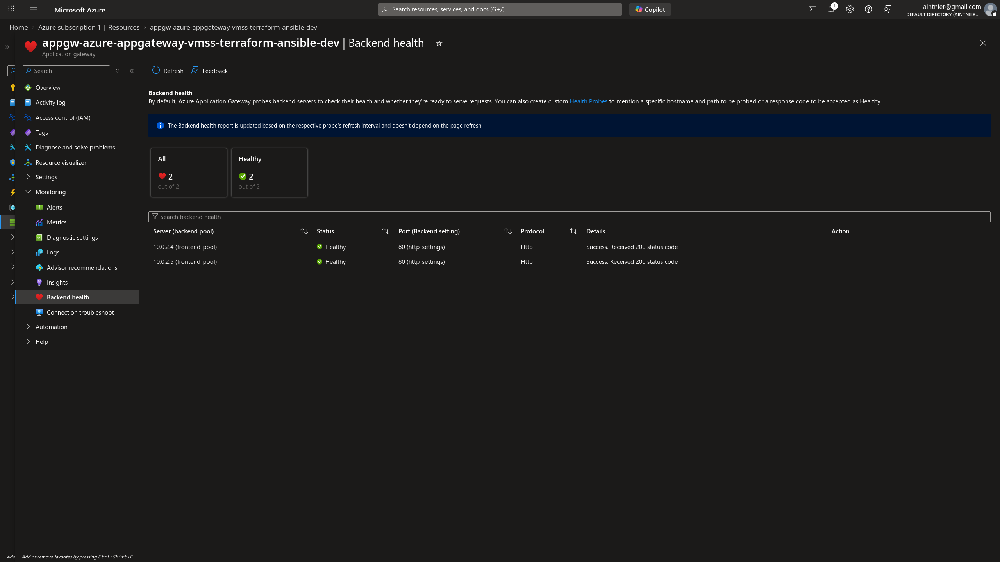
_Fig. 16: App Gateway reporting the Frontend VMSS instances as healthy._
<br>
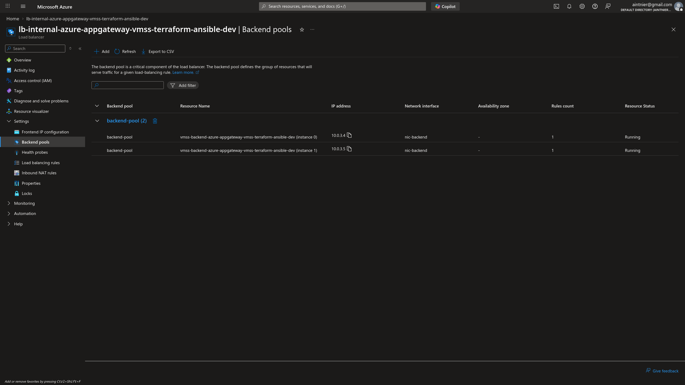
_Fig. 17: Internal LB confirming the Backend VMSS is reachable._

### Path-Based Routing & WAF Inspection (L7)

Path-based routing correctly sends root (`/`) traffic to the frontend pool and `/api` requests to the backend. The WAF (running the OWASP 3.2 ruleset in Detection Mode) intercepts and logs SQL injection payloads without breaking the test traffic.

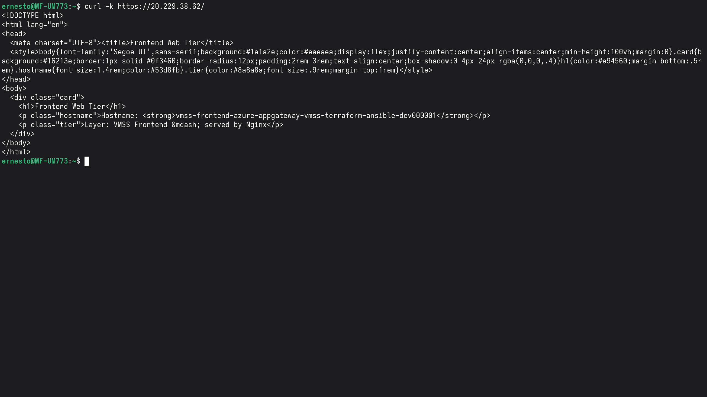
_Fig. 18: `/` route traffic correctly served by the Frontend pool._
<br>
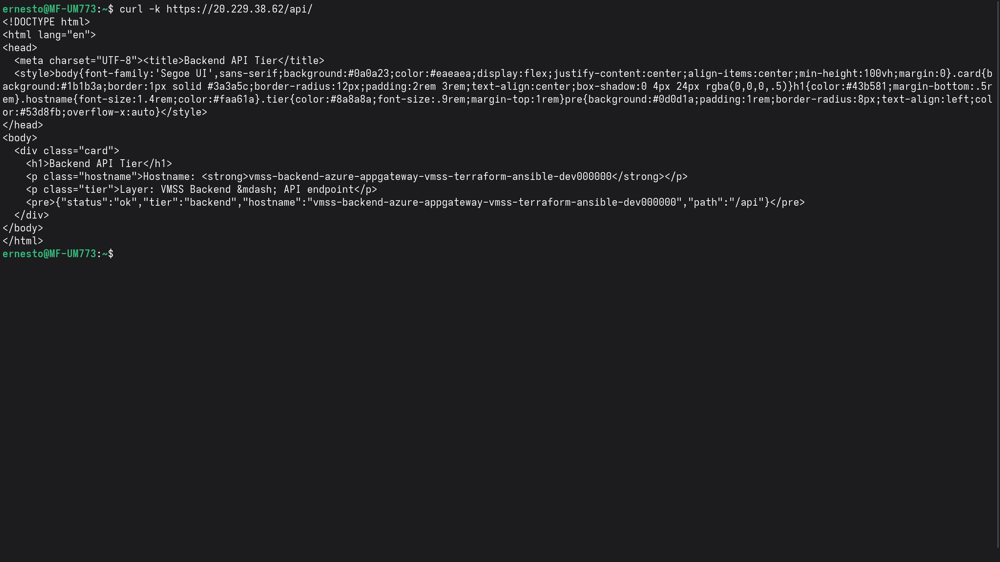
_Fig. 19: `/api` route correctly forwarded to the backend instances._

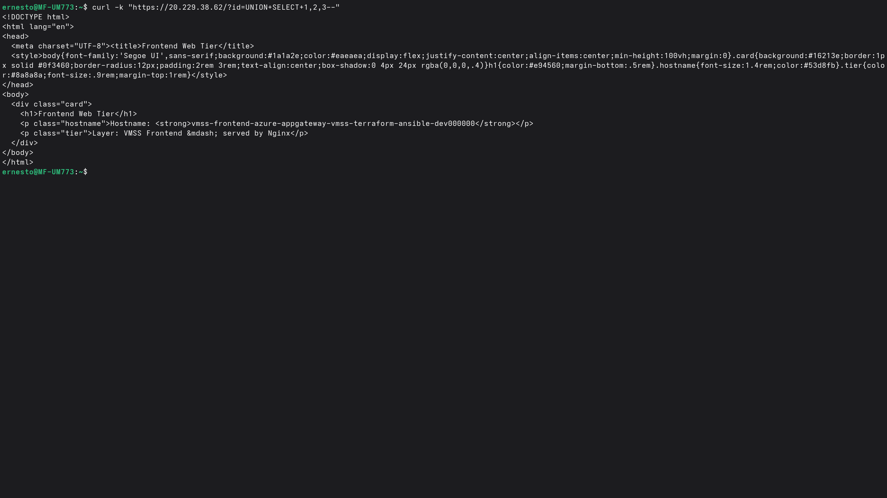
_Fig. 20: Testing a SQL injection payload against the public endpoint._
<br>
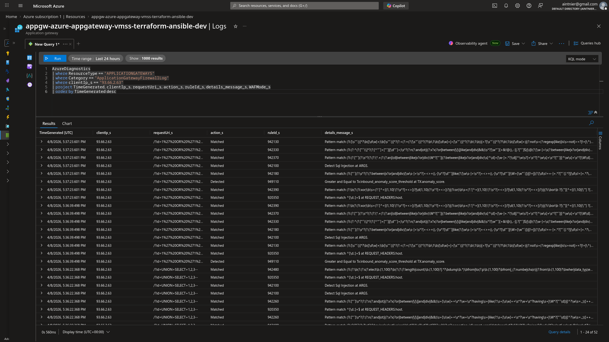
_Fig. 21: Log Analytics catching the OWASP ruleset firing on the payload._

---

## Phase 3: Zero-Trust Secure Access

The compute tier exposes no public IP addresses. Administrative SSH access is handled exclusively through Azure Bastion. Network Security Groups (NSGs) apply the principle of least privilege, allowing only inbound traffic from the App Gateway and internal VNet communication.

### Bastion Debugging & The Missing Egress

During the initial validation phase, a failure in the Ansible bootstrap was diagnosed by accessing a backend VM via Azure Bastion, utilizing the private SSH key retrieved from the Azure Key Vault.

As demonstrated in the diagnostic session below, test commands revealed that the server was unable to contact the Azure Ubuntu archives to install Nginx. This troubleshooting action highlighted a design oversight: I had forgotten to provision a **NAT Gateway** in Terraform, leaving the private VMSS instances without Internet egress. The issue was resolved by introducing the missing infrastructure definition ([`infra/nat-gateway.tf`](infra/nat-gateway.tf)) and re-triggering the deployment pipeline, which compared the previous state and provisioned the missing resources without affecting the already deployed resources.

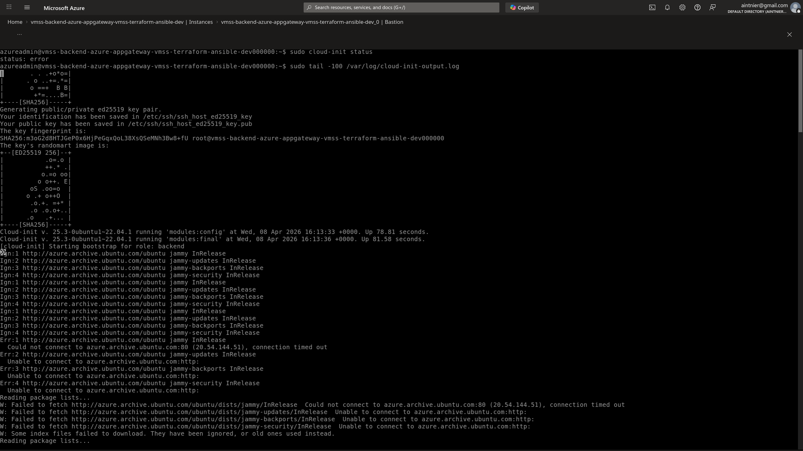
_Fig. 22: SSH session via Azure Bastion highlighting the missing egress connectivity that prevented the cloud-init bootstrap._
<br>
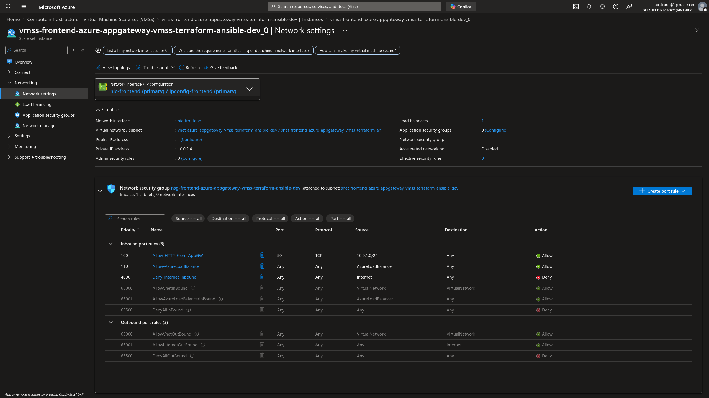
_Fig. 23: NSG inbound rules restricting traffic to the App Gateway and internal VNet._

---

## Phase 4: Load Testing & VMSS Autoscaling

The architecture was validated using Azure Load Testing to generate a sustained load of ~1000 requests per second, with the goal of testing the autoscaling policies.

### SKU Upgrade & Load-Testing Troubleshooting

During the first deployment attempt, the original target VM size (`Standard_B2s`) was not available in the West Europe region. To keep the deployment compliant with the Azure Policy guardrails and avoid blocking the project, I switched to `Standard_D2s_v3`, which was available at deployment time.

This infrastructure-side workaround had a direct effect on the testing phase. The more capable VM size significantly increased the baseline compute capacity of the frontend tier, making the original autoscaling threshold of 70% CPU much harder to reach under synthetic traffic.

In parallel, the first JMeter executions did not generate the expected load. By reviewing the Azure Load Testing worker logs, I identified that the test was effectively sustaining only about 10 req/s, despite the intended higher target. After tuning the [tests/loadtest.jmx](tests/loadtest.jmx) plan, the test reached roughly 1000 req/s.

Even at that higher throughput, the application profile remained lightweight: Nginx was serving static content and reverse-proxying requests with very low CPU overhead on `Standard_D2s_v3`. To validate the autoscaling workflow without redesigning the application into a CPU-bound workload, I temporarily lowered the scale-out threshold in Azure Portal from the production-style 70% value to 5% CPU.

This allowed me to demonstrate the full scaling lifecycle end to end: CPU increase, autoscale rule evaluation, VMSS scale-out, Azure Monitor alerting through the Action Group, and automatic scale-in after the traffic dropped.

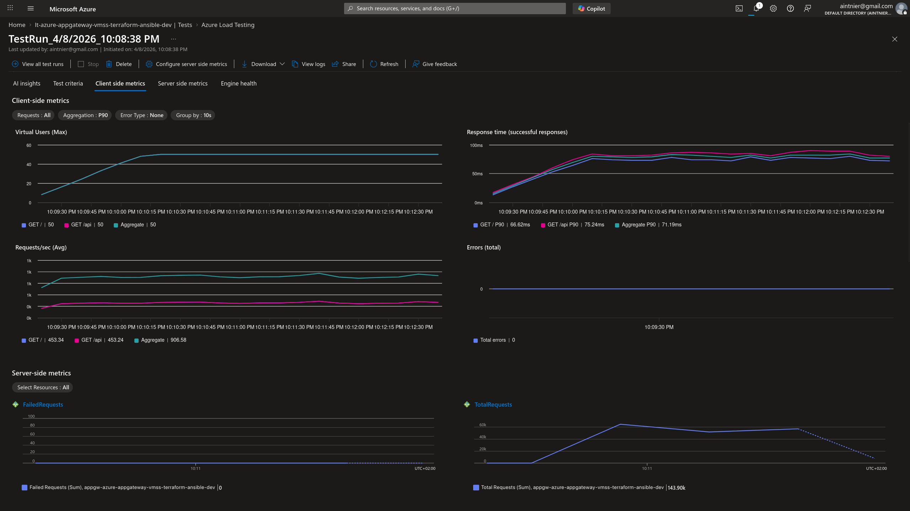
_Fig. 24: Sustaining ~1000 req/s from the Azure Load Testing engine._
<br>
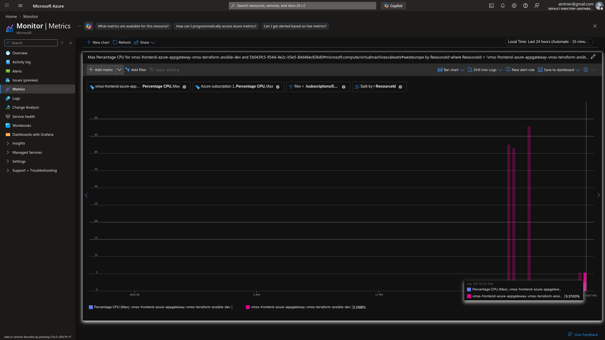
_Fig. 25: CPU utilization peaking just past the manually lowered 5% scale-out threshold._

### Autoscaling Events & Notifications

Azure Monitor detects the CPU spike and triggers a VMSS scale-out, provisioning new nodes to absorb the traffic. Simultaneously, the Action Group sends an email notification about the scaling event. Once the test concludes, the VMSS performs an automatic scale-in to optimize costs.

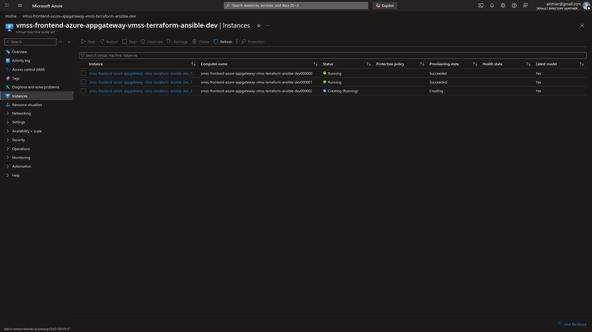
_Fig. 26: VMSS provisioning a new node to handle the load._
<br>
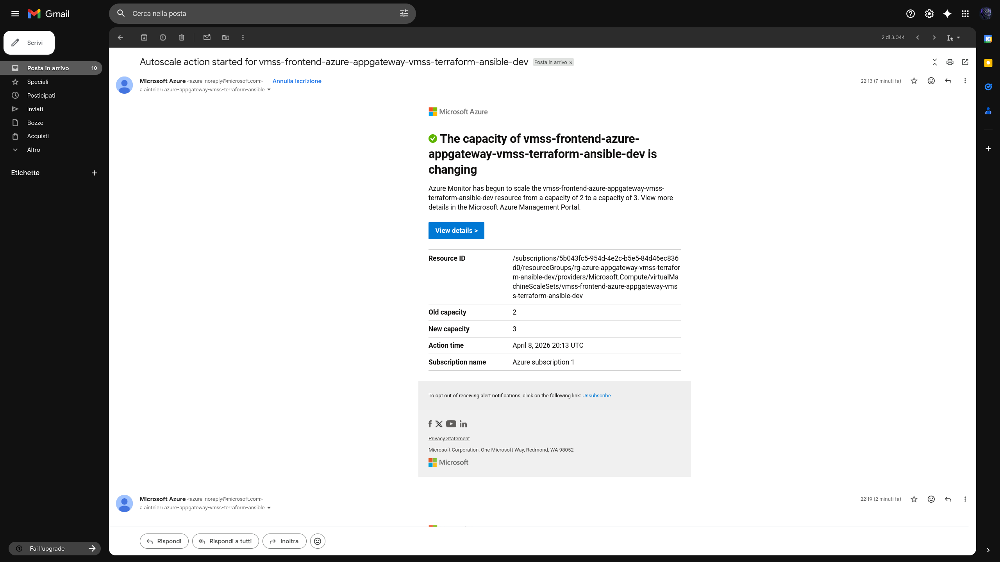
_Fig. 27: Automated email alert confirming the scale-out event._
<br>
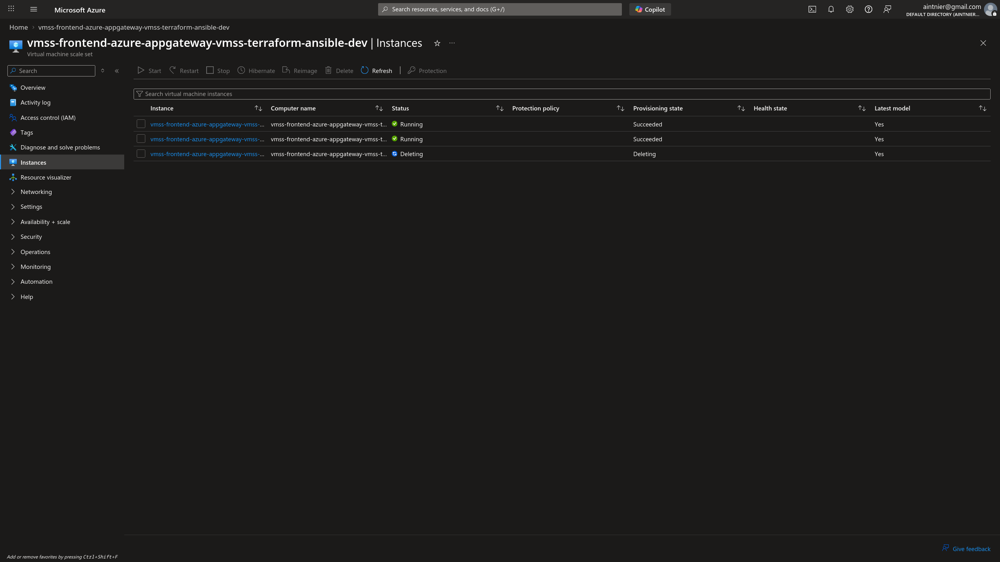
_Fig. 28: VMSS automatically scaling in after the load test drops off._
<br>
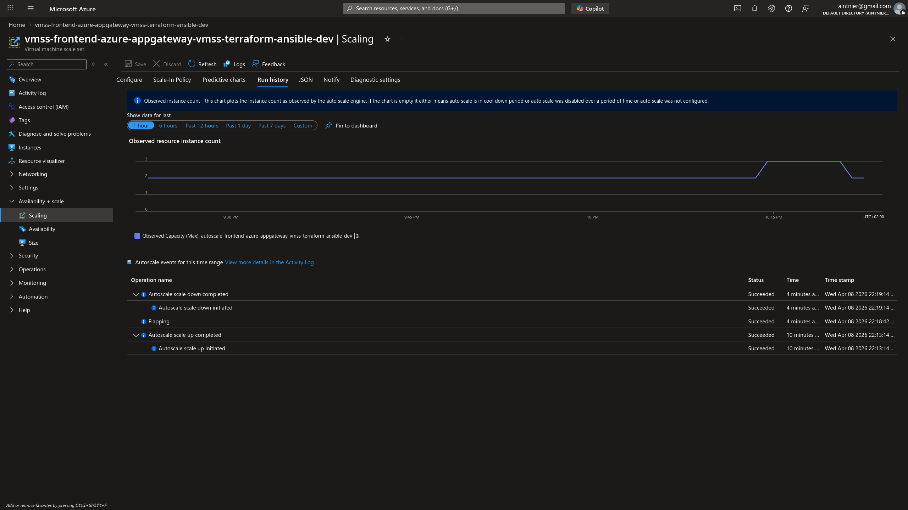
_Fig. 29: Autoscale Run History captured post-test. The graph visually summarizes the entire scaling lifecycle, displaying the initial instance scale-out during the CPU spike, followed by the automatic scale-in once the stress subsided._

---

## Phase 5: Infrastructure Teardown

Once the validation was complete, the `destroy-pipeline.yml` pipeline was triggered to destroy the entire environment, cleanly handling Terraform dependencies (like state file locks and diagnostic logs) and purging all created resources.

---

## Key Technical Decisions

| Decision                                 | Rationale                                                                                                                                                      |
| ---------------------------------------- | -------------------------------------------------------------------------------------------------------------------------------------------------------------- |
| **Basic Rule on AppGW** (not path-based) | Enforces true n-tier serial traversal: AppGW -> Frontend -> Internal LB -> Backend                                                                             |
| **Nginx reverse-proxy on Frontend**      | Frontend VMSS handles path routing (`/api` -> proxy_pass to Internal LB)                                                                                       |
| **Ansible Local Pull via cloud-init**    | Every VMSS instance self-configures at boot - works for autoscale events                                                                                       |
| **Static IP on Internal LB**             | Predictable target for Nginx `proxy_pass` directive                                                                                                            |
| **WAF in Detection mode**                | Prevents blocking synthetic load test traffic while still logging threats                                                                                      |
| **OIDC (Workload Identity Federation)**  | No client secrets to rotate - modern, secure pipeline authentication                                                                                           |
| **Self-Hosted Linux Agent**              | Bypasses Microsoft-hosted parallel job restrictions for new Azure DevOps organizations, ensuring immediate CI/CD execution without requesting capacity grants. |

---

## Known Limitations

- **VM SKU availability in West Europe:** Certain VM SKUs (especially the `Standard_B` series) are not always available due to regional capacity constraints. If quota fails, switch the allowed SKUs to `Standard_D2s_v3` in `variables.tf` and the Azure Policy parameter.
- **Bastion & Application Gateway hourly cost:** Both resources generate significant hourly spend even at idle. The consumption budget and Action Group alerts mitigate surprise bills, but the `destroy` pipeline must be executed promptly after validation to contain costs.

---

## Repository Structure

The IaC is structured following domain-driven flat-file layout best practices, intentionally avoiding a monolithic `main.tf` to improve maintainability.

```
├── 📁 config                                                    # Ansible configuration
│   ├── 📁 templates
│   │   ├── 📄 api.html.j2                                       # Backend API HTML/JSON template
│   │   ├── 📄 index.html.j2                                     # Frontend HTML template
│   │   ├── 📄 nginx-backend.conf.j2                             # Nginx API server config
│   │   └── 📄 nginx-frontend.conf.j2                            # Nginx reverse-proxy config
│   ├── 📄 ansible.cfg                                           # Local-pull optimised settings
│   └── ⚙️ playbook.yml                                          # Main playbook (frontend/backend roles)
├── 📁 docs
│   └── 📁 imgs                                                  # Validation screenshots
├── 📁 infra                                                     # Terraform configuration
│   ├── 📁 scripts
│   │   └── 📄 cloud-init.sh.tpl                                 # Cloud-init template (Ansible local-pull)
│   ├── 📄 appgateway.tf                                         # Application Gateway WAF v2
│   ├── 📄 backend.tf                                            # Backend Standard Load Balancer
│   ├── 📄 bastion.tf                                            # Azure Bastion
│   ├── 📄 compute.tf                                            # Frontend & Backend VMSS + Autoscale
│   ├── 📄 governance.tf                                         # Budget, Policies, Action Groups, Log Analytics
│   ├── 📄 keyvault.tf                                           # Key Vault, TLS cert, SSH key, managed identity
│   ├── 📄 loadbalancer.tf                                       # Internal Standard Load Balancer
│   ├── 📄 loadtesting.tf                                        # Azure Load Testing resource
│   ├── 📄 nat-gateway.tf                                        # NAT Gateway
│   ├── 📄 network-watcher.tf                                    # Network Watcher
│   ├── 📄 networking.tf                                         # RG, VNet, Subnets, NSGs, Public IPs
│   ├── 📄 outputs.tf                                            # All output values
│   ├── 📄 providers.tf                                          # Terraform & provider version pinning
│   └── 📄 variables.tf                                          # All variables + locals
├── 📁 pipelines                                                 # Azure DevOps CI/CD (OIDC)
│   ├── ⚙️ ci-pipeline.yml                                       # fmt-check + validate (PR/push)
│   ├── ⚙️ deploy-pipeline.yml                                   # plan -> approval -> apply
│   └── ⚙️ destroy-pipeline.yml                                  # plan -destroy -> approval -> destroy
├── 📁 tests
│   └── 📄 loadtest.jmx                                          # JMeter test plan (~1000 req/s, 10 min)
├── ⚙️ .gitignore
├── 📄 LICENSE
└── 📝 README.md
```

---

## Tech Stack

| Component      | Technology                                      |
| -------------- | ----------------------------------------------- |
| IaC            | Terraform 1.14.8, AzureRM provider ~> 4.60.0    |
| Configuration  | Ansible (Local-Pull via cloud-init)             |
| CI/CD          | Azure DevOps Pipelines                          |
| Cloud          | Microsoft Azure (westeurope)                    |
| Authentication | OIDC Federated Identity Credential              |
| Web Server     | Nginx (reverse-proxy + API server)              |
| Compute        | VMSS Ubuntu 22.04 LTS (Standard_D2s_v3)         |
| Load Testing   | Azure Load Testing + JMeter                     |
| Observability  | Log Analytics, Azure Monitor, Network Watcher   |
| Governance     | Azure Policy, Consumption Budget, Action Groups |

---

## License

See [LICENSE](LICENSE) for details.
